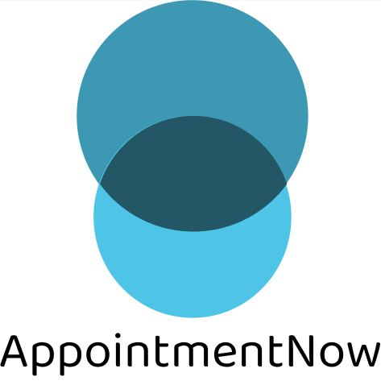
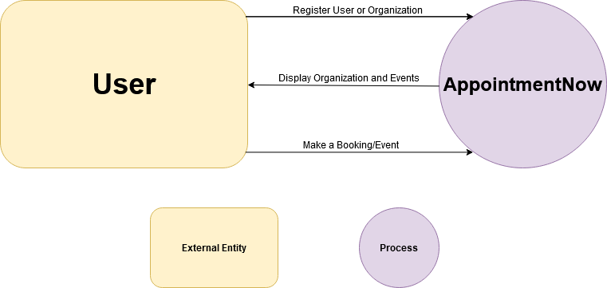
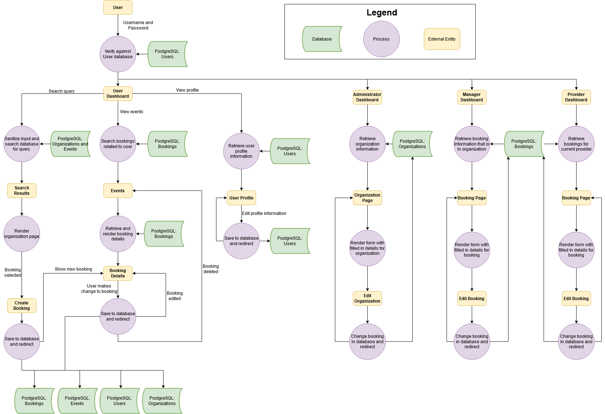
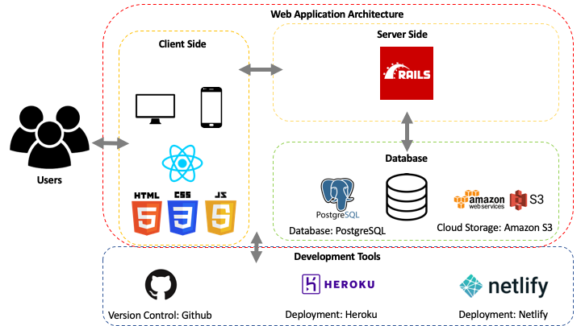
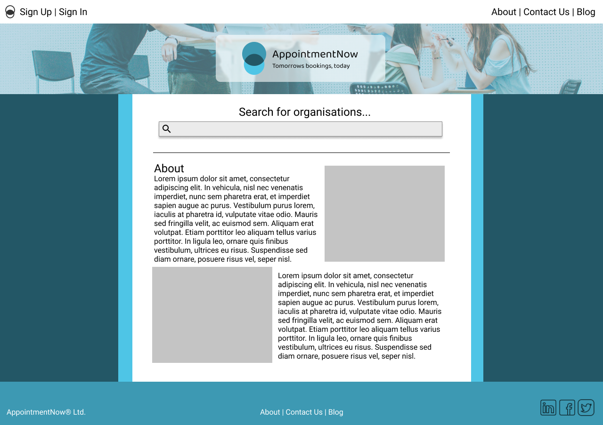
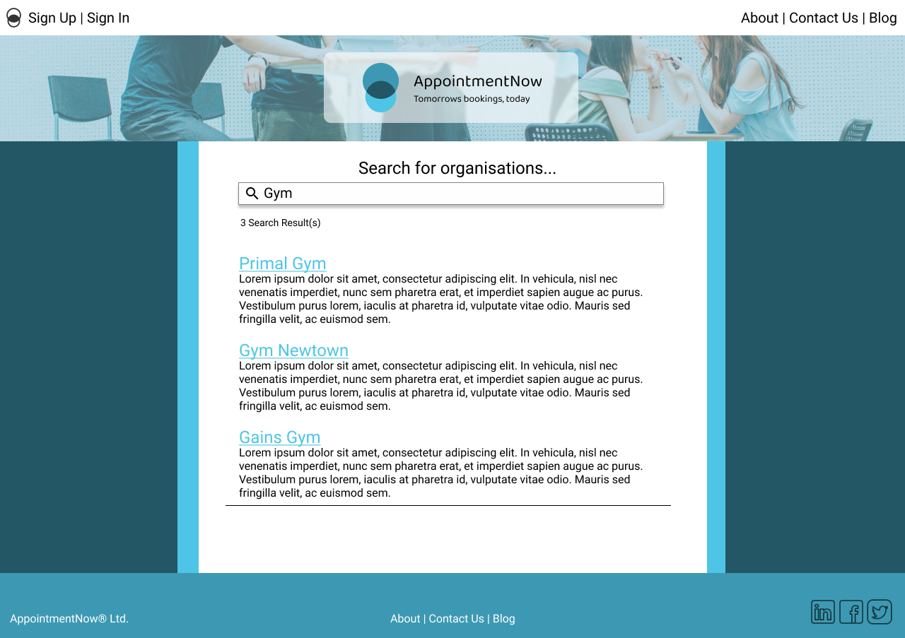
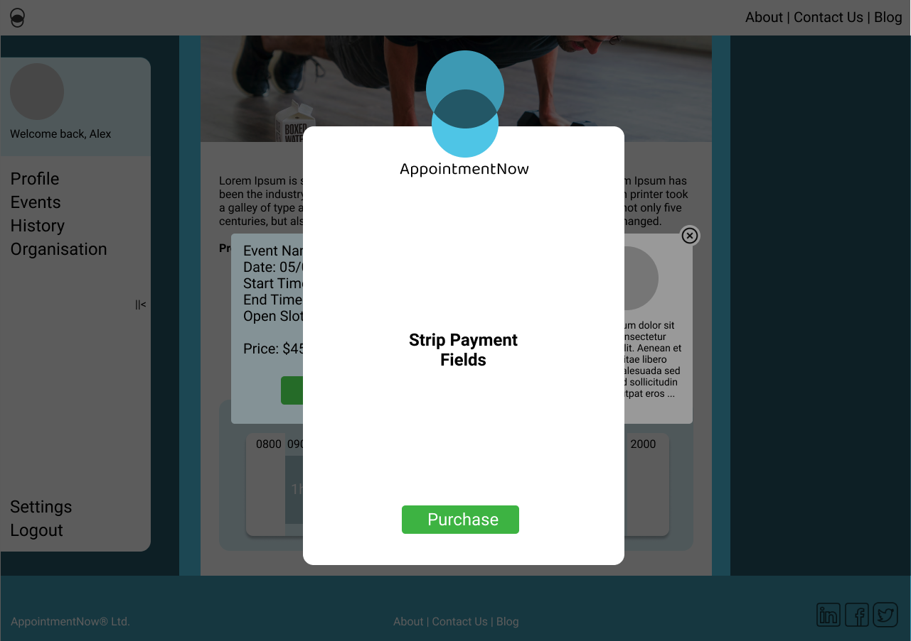
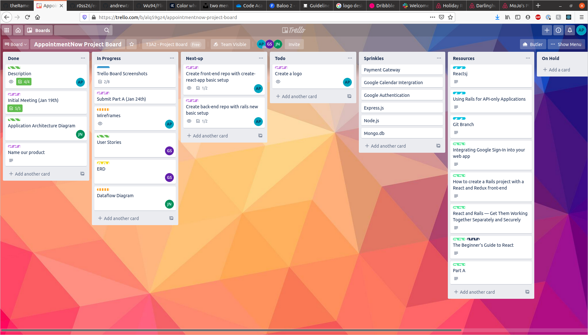
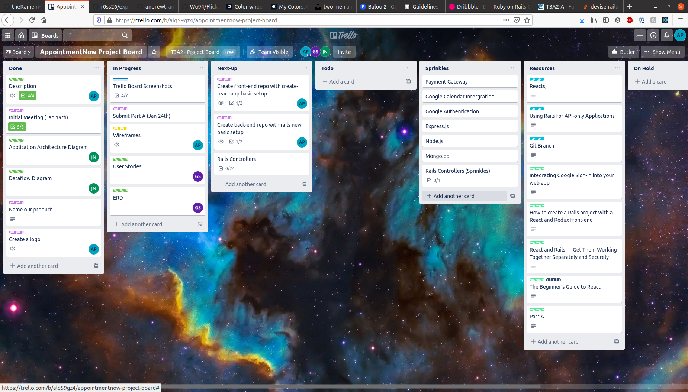

# Term 3 Assignment 2 - Alex Pike, Andrew "Gavin" Simms, Jackson Ngo

---

### R1

#### Description of your website, including:

#### - Purpose

#### - Functionality / features

#### - Target audience

#### - Tech stack

### A1

### **Intro**

The purpose of this repository is to provide documentation and be a landing page for our Term 3 Assignment 2, Full Stack Web Application project.

---

### **Links**

Website URL: TODO

Website API: TODO

Front-end repo: https://github.com/theRamenWithin/AppointmentNow_FrontEnd

Back-end repo: https://github.com/theRamenWithin/AppointmentNow_BackEnd

---

### **Purpose**

**AppointmentNow** aims to solve the problem of small businesses needing a modular appointment booking system that can be customised to their needs without having to commision expensive, bespoke software. It aims to have an inutiative interface with granular complexity.

---

### **Functionality / Features**

#### **Profile customisation**

- Customers, Providers and Organisations each have their own profiles with useful information inside them that they can edit and make publically available.

### **Unique Organisations**

- A Provider can create or join a new Organisation. Each Organisation has a unique URL that Customers can access to see all the Providers, events and bookings owned by that organisation.

### **Search**

- Customers can search for Organisations on the main index page. Once on an Organisation page, they can search for Providers, Events and Bookings by name, date and time.

### **Appointments**

- Providers can create Events that occur on a date and set the Booking slots available for that Event.
- Customers can view the available Booking slots and to make an appointment.

### **History**

- Customers and Providers can see their current bookings and a history of past bookings.

### **Management**

- Providers with a Manager role can manage Providers, Events and Bookings under them.
- Providers with an Administrator role can do the same and edit details about the Organisation.

---

### **Target Audience**

The application sits between **Customers** (such as, gym-goers) and **Organisations** (such as, a gyms) who offer **Providers** (such as, class instructors) that have **Events** (such as, classes) which have specific time slots as **Bookings**.

As such, the target audience is Customers who wish to make Bookings on Events, hosted by Providers who belong to an Organisation. As well as Providers who belong to an Organisation who wants to offer Events that have Booking times to Customers.

---

### **Tech Stack**

#### Front-End

- HTML5
  - Semantic-UI
- CCS3
- JavaScript
- React

#### Back-End

- Rails
  - Faker
  - cors-react
  - jQuery
  - Devise
  - CanCanCan
- AWS S3

#### Database

- Postgres

#### Deployment

- Heroku (back-end)
- Netlify (front-end)

#### Version Control

- Git
- Github

#### Project Management

- Trello
- Discord
- Google Docs
- Lucid Chart

---

---

### R2

#### Dataflow Diagram

### A2

ERD

Level 0: Abstraction of User-Application Interaction

Level 1: Abstraction of Application Features

Level 2: Abstraction of Application Sub-Processes

---
---

### R3

#### Application Architecture Diagram

### A3

---

---

### R4

#### User Stories

### A4

#### Customers:

- As a customer I'd like to be able to see avalible appointment times.
- As a customer I'd like to book a providers time.
- As a customer I'd like cancel a booking.
- As a customer I'd like to edit a booking I have made.
- As a customer I’d like to view my bookings.
- **_As a customer I’d like to have an email confirmation when I create a booking, or my booking has changed._**
- **_As a customer I’d like to be able to pay for my bookings online during the booking process._**
- As a customer I’d like to create my own user profile, and save details against my profile.
- As a customer I'd like to be able to update my user profile.
- As a customer I'd like to have a username/password to
- **_As a customer I’d like to use OAuth to log into the site._**
- **_As a customer I'd like to leave reveiws of my bookings/appointments._**
- As a customer I'd like to have a record of my historic bookings

#### Providers:

- **_As a provider I’d like to be able to respond to reviews._**
- As a provider I’d like to set how many customers can join an appointment.
- As a provider I’d like to create appointments that contain a: Title: Description: Date: Booking (ID): Customers: Cost?:
- As a Provider I’d like to have my own profile.
- As a Provider I'd like to be able to search for Bookings/Appointments
- As a Provider I'd like to be able to connect my sub-providers to customers (for example in the case of a Gym being a Provider; connecting the Gym Instructors to the Gym Members).

#### Managers:

- As a Manager I’d like to add additional providers to appointments…

#### Administrators:

- As a Administrator I’d like to add information about my Organisation.
- As an Administrator I’d like to manage my Organisation.

---

---

### R5

#### Wireframes for multiple standard screen sizes, created using industry standard software

### A5

Index 
 
Search 
 
Sign Up 
 
Join Organisation 
 
Edit Organisation 
 
Show Public View 
 
Event Index 
 
Create Event 
 
Show Event 
 
Book Event 
 
Stripe 
 
Stripe Success 
 
Tablet View 
 
Mobile View 

---

---

### R6

#### Screenshots of your Trello board throughout the duration of the project

### A6

Day 1

Day 2

Day 4

Day 5
