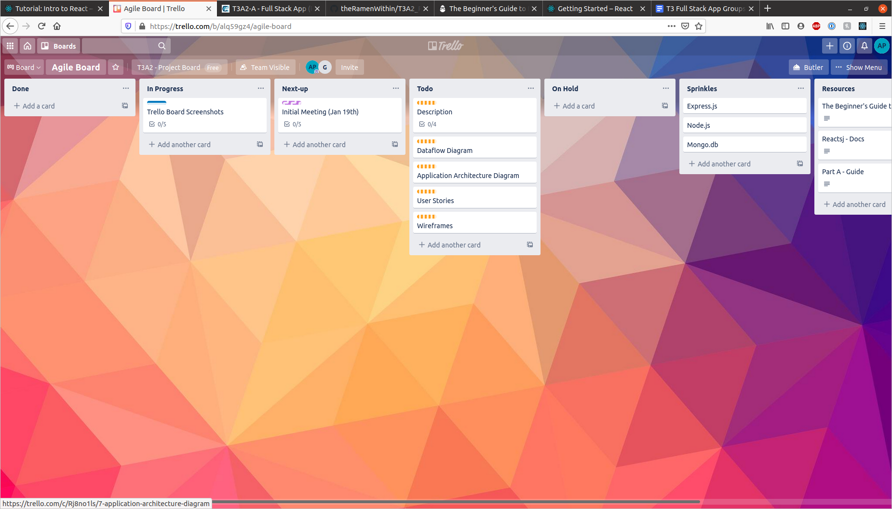
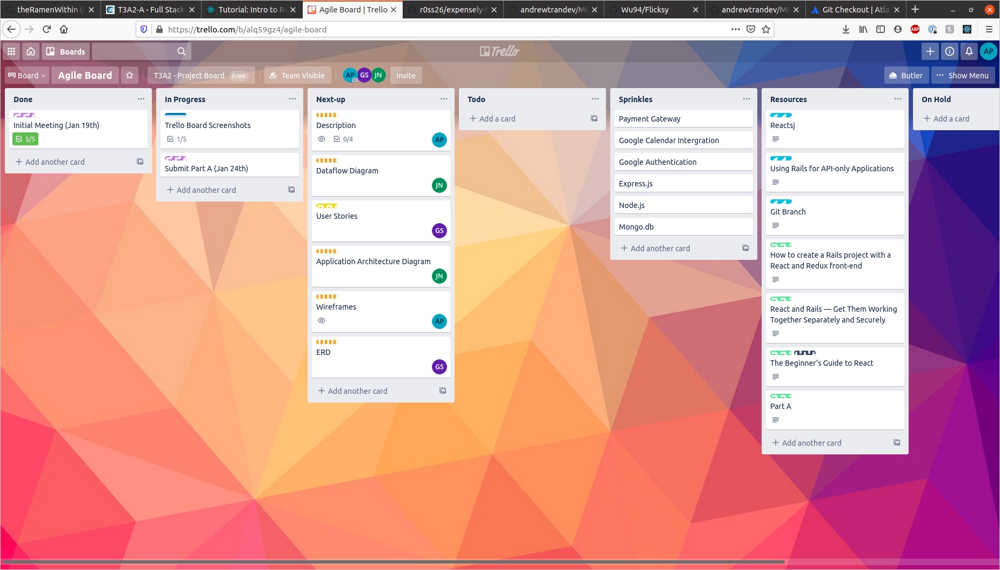

# Term 3 Assignment 2 - Alex Pike, Andrew "Gavin" Simms, Jackson Ngo
---

### R1

#### Description of your website, including:
#### - Purpose
#### - Functionality / features
#### - Target audience
#### - Tech stack

### A1

### **Intro**

The purpose of this repository is to provide documentation and be a landing page for our Term 3 Assignment 2, Full Stack Web Application project.

---

### **Links**

Website URL: TODO

Website API: TODO

Front-end repo:TODO

Back-end repo: TODO

---

### **Purpose**

**AppointmentNow** aims to solve the problem of small businesses needing a modular appointment booking system that can be customised to their needs without having to commision expensive, bespoke software. It aims to have an inutiative interface with granular complexity.

---

### **Functionality / Features**

Profile customisation
Search for bookings by time, provider and type of booking.
View current and past bookings.
TODO (link this in with user stories)

---

### **Target Audience**

The application sits between **Customers** (such as, gym-goers) and **Organisations** (such as, a gyms) who offer **Providers** (such as, class instructors) that have **Events** (such as, classes) which have specific time slots as **Bookings**.

---

### **Tech Stack**

#### Front-End
* HTML5
    * Semantic-UI
* CCS3
* JavaScript
* React
#### Back-End
* Rails
    * Faker
    * cors-react
    * jQuery
    * Devise
    * CanCanCan
* AWS S3
#### Database
* Postgres
#### Deployment
* Heroku (back-end)
* Netlify (front-end)
#### Version Control
* Git
* Github
#### Project Management
* Trello
* Discord
* Google Docs
* Lucid Chart

---
---

### R2

#### Dataflow Diagram

### A2

---
---

### R3

#### Application Architecture Diagram

### A3

---
---

### R4

#### User Stories

### A4

#### Customers:

- As a customer I'd like to be able to see avalible appointment times.
- As a customer I'd like to book a providers time.
- As a customer I'd like cancel a booking.
- As a customer I'd like to edit a booking I have made.
- As a customer I’d like to view my bookings.
- ***As a customer I’d like to have an email confirmation when I create a booking, or my booking has changed.***
- ***As a customer I’d like to be able to pay for my bookings online during the booking process.***
- As a customer I’d like to create my own user profile, and save details against my profile.
- As a customer I'd like to be able to update my user profile.
- As a customer I'd like to have a username/password to 
- ***As a customer I’d like to use OAuth to log into the site.***
- ***As a customer I'd like to leave reveiws of my bookings/appointments.***
- As a customer I'd like to have a record of my historic bookings

#### Providers:

- ***As a provider I’d like to be able to respond to reviews.***
- As a provider I’d like to set how many customers can join an appointment.
- As a provider I’d like to create appointments that contain a: Title: Description: Date: Booking (ID): Customers:  Cost?:
- As a Provider I’d like to have my own profile.
- As a Provider I'd like to be able to search for Bookings/Appointments
- As a Provider I'd like to be able to connect my sub-providers to customers (for example in the case of a Gym being a Provider; connecting the Gym Instructors to the Gym Members).

#### Managers:

- As a Manager I’d like to add additional providers to appointments… 

#### Administrators:

- As a Administrator I’d like to add information about my Organisation.
- As an Administrator I’d like to manage my Organisation.

---
---

### R5

#### Wireframes for multiple standard screen sizes, created using industry standard software

### A5

### ERD

---
---

### R6

#### Screenshots of your Trello board throughout the duration of the project

### A6

