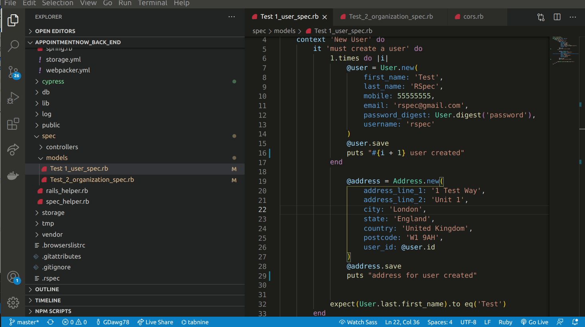
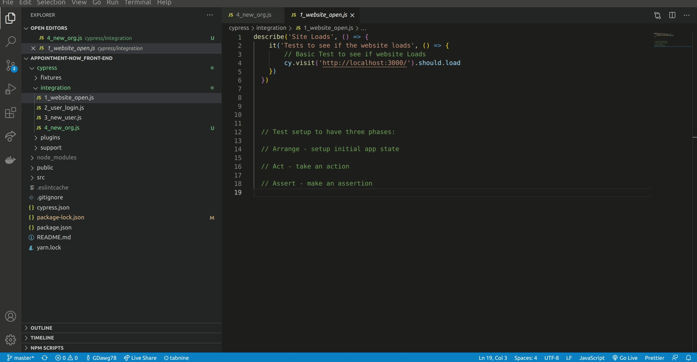

# Term 3 Assignment 2 - Alex Pike, Andrew "Gavin" Simms, Jackson Ngo

### R3

#### Employ and utilise proper source control methodology (git)

### A3

Github repo insights showing commit history

https://github.com/GDawg78/appointmentnow_back_end/pulse/monthly

https://github.com/theRamenWithin/appointment-now_front-end/pulse/monthly

---
---

### R4

#### Demonstrate your ability to work in a team

### A4

https://trello.com/b/alq59gz4/appointmentnow-project-board

---
---

### R6

#### Deploy the application to a cloud hosting service

### A6

https://appointmentnow.netlify.app/

https://appointmentnow.herokuapp.com/

### A8 Provides evidence of user testing

[Testing spreadsheet](./docs/testing.xlsx)

### R9

#### Utilises a formal testing framework

##### RSPEC Testing of creation of working models Rails Back End

#### Cypress Testing of Website load, user login and user creation.

### R10

#### A link (URL) to your deployed website

### A10

https://appointmentnow.netlify.app/

### R11

#### A link to your GitHub repository (repo)

### A11

**Front End:**
https://github.com/theRamenWithin/appointment-now_front-end

**Back End:**
https://github.com/GDawg78/appointmentnow_back_end

---
---

### R12

#### The contents of your README.md as submitted for Full Stack App - Part A

### A12

[Old README](./docs/README.md)